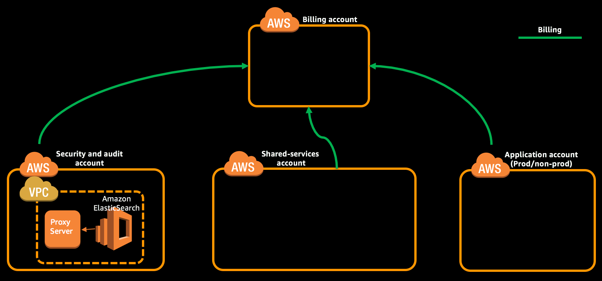

As part of this module you will launch a CloudFormation stack instance in **Security account** which will create a VPC, ElasticSearch cluster, enable CloudTrail and create Proxy server as authentication mechanism.

> This should be performed on Security account in **Ireland (eu-west-1)** region.

**Table of Contents:**
-   [Launch the Centralized Logging CloudFormation stack](#launch-the-centralized-logging-cloudformation-stack)
-   [Expected Outcome](expected-outcome)


## Launch the Centralized Logging CloudFormation stack

1.  Login to "Security Account" with **PayerAccountAccessRole** role created as part of account creation using the [cross account switch role](http://docs.aws.amazon.com/IAM/latest/UserGuide/id_roles_use_switch-role-console.html) capability.

2.  Change the region to Ireland (eu-west-1) by [selecting the region](http://docs.aws.amazon.com/awsconsolehelpdocs/latest/gsg/getting-started.html#select-region) from the top right of Management Console.

3.  Navigate to [CloudFormation](https://eu-west-1.console.aws.amazon.com/cloudformation/home?region=eu-west-1#/stacks?filter=active) console and create a new stack using [centralized-log-analytics.yml](../templates/centralized-log-analytics.yml) template.

4.  Provide a Stack Name, review the parameters and select appropriate values for the list mentioned below.

    -   ProxyPass - Update the passwords to a string between 6 and 41 characters containing letters, numbers and symbols.
    -   SSHLocation - CIDR IP range to which SSH access to the Proxy server and HTTP access to the Kibana ELB should be enabled. (You shall get your current address using <http://checkip.dyndns.org/>)
    -   NotifyEmail - Validate email address to send notification.
    -   CloudTrailLogGroup - Get the value of CloudTrailLogGroup from the output of the "CloudTrail Baseline" stack instance created in the Security account and provide it here.

5.  Select the checkbox under Capabilities in subsequent pages to allow CloudFormation to create IAM resources.

6.  Create the stack.

**Using CLI:**

1.  Open [centralized-log-analytics-parameters.json](../templates/centralized-log-analytics-parameters.json) (located inside templates directory) in your favorite text editor and review the parameters.

2.  Update the ParameterValue of the following ParameterKeys.

    -   ProxyPass - Update the passwords to a string between 6 and 41 characters containing letters, numbers and symbols.
    -   SSHLocation - CIDR IP range to which SSH access to the Proxy server and HTTP access to the Kibana ELB should be enabled. (You shall get your current address using <http://checkip.dyndns.org/>)
    -   NotifyEmail - Validate email address to send notification.
    -   CloudTrailLogGroup - Get the value of CloudTrailLogGroup from the output of the "CloudTrail Baseline" stack instance created in the Security account and provide it here.

3.  Create the stack using following command.
    ```
    aws cloudformation create-stack --stack-name CentralizedLogging --capabilities CAPABILITY_NAMED_IAM --region eu-west-1 --profile security --template-body file://templates/centralized-log-analytics.yml --parameters file://templates/centralized-log-analytics-parameters.json
    ```
    ```json
    {
        "StackId": "arn:aws:cloudformation:us-east-1:987654321098:stack/CentralizedLogging/3d1abad2-ba80-11e7-93d4-28a3c090500c"
    }
    ```

    You shall check the status of the stack creation using following command.
    ```
    aws cloudformation describe-stack-events --stack-name CentralizedLogging --region eu-west-1 --profile security --output table --query 'StackEvents[*].{LogicalId:LogicalResourceId, ResourceType: ResourceType, Status: ResourceStatus}'
    -----------------------------------------------------------------------------------------------------------
    |                                           DescribeStackEvents                                           |
    +-----------------------------------------+-----------------------------------------+---------------------+
    |                LogicalId                |              ResourceType               |       Status        |
    +-----------------------------------------+-----------------------------------------+---------------------+
    |  MyVPC                                  |  AWS::EC2::VPC                          |  CREATE_COMPLETE    |
    |  InternetGateway                        |  AWS::EC2::InternetGateway              |  CREATE_COMPLETE    |
    |  WebServerLogGroup                      |  AWS::Logs::LogGroup                    |  CREATE_COMPLETE    |
    |  LogStreamerRole                        |  AWS::IAM::Role                         |  CREATE_IN_PROGRESS |
    |  WebServerLogGroup                      |  AWS::Logs::LogGroup                    |  CREATE_IN_PROGRESS |
    |  SolutionHelperRole                     |  AWS::IAM::Role                         |  CREATE_IN_PROGRESS |
    |  MyVPC                                  |  AWS::EC2::VPC                          |  CREATE_IN_PROGRESS |
    |  LogRole                                |  AWS::IAM::Role                         |  CREATE_IN_PROGRESS |
    |  InternetGateway                        |  AWS::EC2::InternetGateway              |  CREATE_IN_PROGRESS |
    |  WebServerLogGroup                      |  AWS::Logs::LogGroup                    |  CREATE_IN_PROGRESS |
    |  LogStreamerRole                        |  AWS::IAM::Role                         |  CREATE_IN_PROGRESS |
    |  InternetGateway                        |  AWS::EC2::InternetGateway              |  CREATE_IN_PROGRESS |
    |  SolutionHelperRole                     |  AWS::IAM::Role                         |  CREATE_IN_PROGRESS |
    |  MyVPC                                  |  AWS::EC2::VPC                          |  CREATE_IN_PROGRESS |
    |  LogRole                                |  AWS::IAM::Role                         |  CREATE_IN_PROGRESS |
    |  CentralizedLogging                     |  AWS::CloudFormation::Stack             |  CREATE_IN_PROGRESS |
    +-----------------------------------------+-----------------------------------------+---------------------+
    ```

    Once the stack has been created completely you shall get the output of the stack using following command.
    ```
    aws cloudformation describe-stacks --stack-name CentralizedLogging --region eu-west-1 --profile security --query 'Stacks[0].Outputs[*].{Key:OutputKey, Value:OutputValue}' --output table
    --------------------------------------------------------------------------------------------------------------------
    |                                               DescribeStacks                                                     |
    +-------------------------+----------------------------------------------------------------------------------------+
    |        Key      |                                              Value                                             |
    +-------------------------+----------------------------------------------------------------------------------------+
    |  DomainEndpoint |  centralizedlogging-arc325-team1-qgix7jo3bjwzpdhqr3ylv5yam4.eu-west-1.es.amazonaws.com/        |
    |  KibanaURL      | http://centralizedlogging-elb-eu-west-1-1332234151.eu-west-1.elb.amazonaws.com/_plugin/kibana/ |
    +-------------------------+----------------------------------------------------------------------------------------+
    ```

> **Note:**
> It will take approximately 15 to 20 minutes to complete the stack creation. Proceed with the other modules and this can be followed up later.

## Expected Outcome
*   Successfully created centralized logging CloudFormation stack in `Security` account.
    -   Created a VPC
    -   Created Amazon ElasticSearch
    -   Created Proxy server in-front of ElasticSearch to enable authentication.


